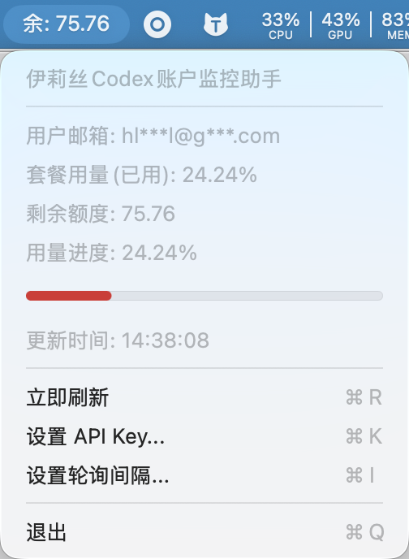

# yls-yy-app

一个原生 `macOS` 状态栏应用（Menu Bar App），用于轮询接口并显示余额信息。

## 应用展示

<p align="center">
  
</p>

<p align="center">
  
</p>

## 功能

- 每隔 N 秒轮询接口（可配置）
- 可在菜单中配置 `API Key`
- 状态栏直接显示剩余额度（`remaining_quota`）
- 菜单显示：
  - 套餐用量（`state.userPackgeUsage`）
  - 剩余额度（`state.remaining_quota`）
  - 最后更新时间/错误信息

## 接口

- `GET https://codex.ylsagi.com/codex/info`
- Header: `Authorization: Bearer <apiKey>`

## 运行

```bash
swift run
```

运行后可在 macOS 顶部状态栏看到应用，点击图标菜单进行：

- `设置 API Key...`
- `设置轮询间隔...`
- `立即刷新`

## 在 Xcode 中运行

1. 打开 Xcode
2. `File -> Open...` 选择本项目目录（Swift Package）
3. 选择可执行目标后直接 `Run`

## 说明

- 这是无主窗口应用，不会打开普通窗口。
- 配置保存在 `UserDefaults` 中（本机本用户）。

## CI/CD 自动打包发布

仓库已包含两个 GitHub Actions 工作流：

- `.github/workflows/ci.yml`：在推送 `v*` tag 时执行 `swift build`
- `.github/workflows/release-macos-app.yml`：在推送 `v*` tag 时自动构建 `.app` 并发布到 GitHub Release

### 发布流程

1. 提交并推送代码到 `main`
2. 创建并推送版本 tag：

```bash
git tag v0.1.0
git push origin v0.1.0
```

3. Actions 会自动生成可下载文件：
   - Release Assets：`伊莉丝Codex账户监控助手.zip`
   - Workflow Artifacts：`macos-app-zip`

## 本地打包

```bash
scripts/build_macos_app.sh
```

输出在 `dist/` 目录：

- `伊莉丝Codex账户监控助手.app`
- `伊莉丝Codex账户监控助手.zip`
