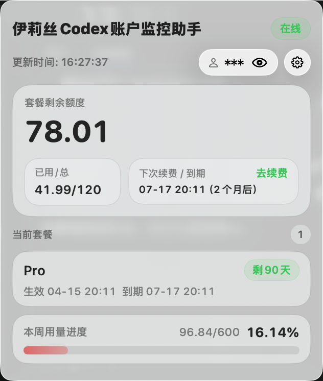
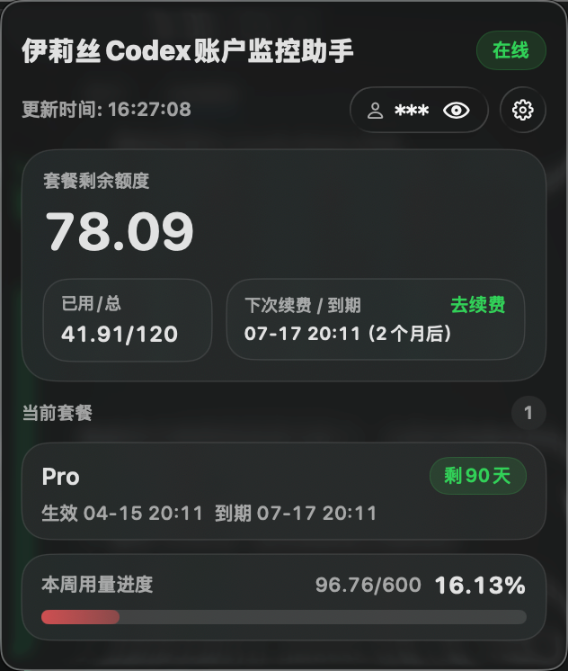

# yls-yy-app

一个原生 `macOS` 状态栏应用（Menu Bar App），用于轮询接口并显示余额信息。

## 应用展示

<p align="center">
  
</p>

<p align="center">
  
  
</p>

## 功能

- 每隔 N 秒轮询接口（可配置）
- 可在菜单中配置 `API Key`
- 状态栏直接显示剩余额度（`remaining_quota`）
- 启动时自动拉起本地 MCP 快照服务，供 AI 连接读取最新数据
- 菜单显示：
  - 套餐用量（`state.userPackgeUsage`）
  - 剩余额度（`state.remaining_quota`）
  - 最后更新时间/错误信息
  - MCP 服务状态与地址

## 接口

- `GET https://codex.ylsagi.com/codex/info`
- Header: `Authorization: Bearer <apiKey>`

## 运行

```bash
swift run
```

运行后可在 macOS 顶部状态栏看到应用，点击图标菜单进行：

- `设置 API Key...`
- `设置轮询间隔...`
- `立即刷新`

## 在 Xcode 中运行

1. 打开 Xcode
2. `File -> Open...` 选择本项目目录（Swift Package）
3. 选择可执行目标后直接 `Run`

## 说明

- 这是无主窗口应用，不会打开普通窗口。
- 配置保存在 `UserDefaults` 中（本机本用户）。
- 默认会在本机启动 HTTP 服务：`http://127.0.0.1:8765/mcp/snapshot`
- AI 或其他本地工具可以读取这个地址，拿到当前余额、用量、套餐到期时间、轮询间隔等最新快照数据。

### MCP 快照接口

应用启动后，如果已启用 MCP 服务，可访问：

- `GET /health`
- `GET /snapshot`
- `GET /mcp/snapshot`
- `POST /mcp`（JSON-RPC / MCP 风格接口）

示例：

```bash
curl http://127.0.0.1:8765/mcp/snapshot
```

返回 JSON 快照，包含：

- 当前状态（在线/异常/未配置）
- 最新余额
- 用量与百分比
- 最近续费/到期时间
- 套餐摘要
- 当前轮询间隔
- 当前显示样式

### MCP JSON-RPC 能力

目前已支持这些常用方法：

- `initialize`
- `tools/list`
- `tools/call`
- `resources/list`
- `resources/read`

内置对象：

- Tool: `get_codex_monitor_snapshot`
- Resource: `yls://codex-monitor/snapshot`

示例：

```bash
curl -X POST http://127.0.0.1:8765/mcp \
  -H 'Content-Type: application/json' \
  -d '{
    "jsonrpc": "2.0",
    "id": 1,
    "method": "tools/call",
    "params": {"name": "get_codex_monitor_snapshot"}
  }'
```

## CI/CD 自动打包发布

仓库已包含两个 GitHub Actions 工作流：

- `.github/workflows/ci.yml`：在推送 `v*` tag 时执行 `swift build`
- `.github/workflows/release-macos-app.yml`：在推送 `v*` tag 时自动构建 `.app` 并发布到 GitHub Release

### 发布流程

1. 提交并推送代码到 `main`
2. 创建并推送版本 tag：

```bash
git tag v0.1.0
git push origin v0.1.0
```

3. Actions 会自动生成可下载文件：
   - Release Assets：`伊莉丝Codex账户监控助手.dmg`
   - Workflow Artifacts：`macos-app-bundle-and-dmg`（包含 `.app` 与 `.dmg`）
   - 产物默认包含 `arm64 + x86_64` 通用二进制，可直接运行在 Apple Silicon 和 Intel Mac 上

## 本地打包

```bash
scripts/build_macos_app.sh
```

输出在 `dist/` 目录：

- `伊莉丝Codex账户监控助手.app`
- `伊莉丝Codex账户监控助手.dmg`

默认产出 `arm64 + x86_64` 通用包；如果你只想打单架构，可以显式指定：

```bash
BUILD_ARCHS="arm64" scripts/build_macos_app.sh
BUILD_ARCHS="x86_64" scripts/build_macos_app.sh
```
